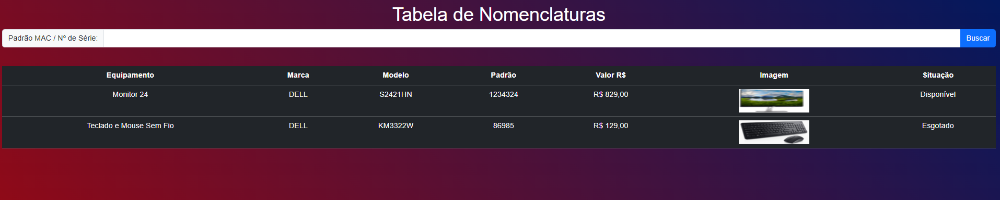
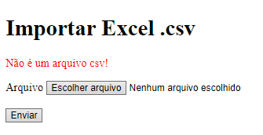

# Aplicação Web  

## **Tabela de Pequisa**

*A Tabela de Pesquisa permite a adição de produtos e oferece a possibilidade de realizar buscas conforme o tipo de filtro informado.*

## Ferramentas

  
  
  
  
  

 

# Página Inicial
Página para realizar busca dos produtos. 

# Importar arquivos CSV
Através do arquivo processa.php é possível importar ao banco de dados as informações no formato CSV. 

 

 
 

# Créditos
<table>
  <tr>
    <td align="center">
      <a href="https://github.com/fabriciovale20">
         
        
          <b>Fabrício Vale</b>
        
      </a>
    </td>
  </tr>
</table>
